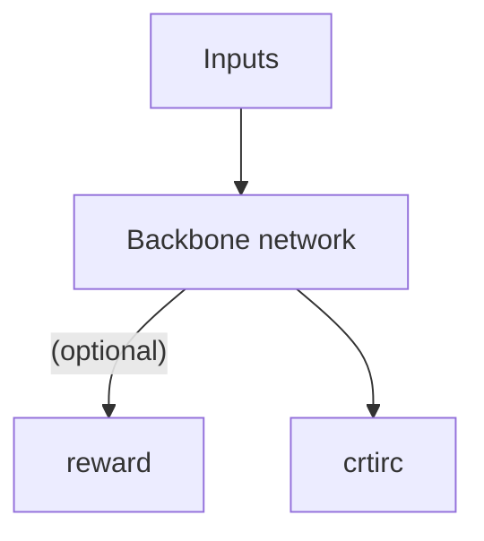

# PPO

## 1. Complete Pipeline

prompt batch -> actor.forward -> reward model -> critic.forward

## 2. Algorithm Implementation

1. **Importance sampling**: Use a single sample to perform multiple updates. This maximizes sample efficiency while correcting for the divergence between the old policy and the new policy.
2. **Clipping** (most common) **/ KL constraint**: Limits the shift between the old and new policies to prevent gradient explosion or collapse.

### 1. Formulas

1. Probability ratio
   $$r_t(\theta) = \frac{\pi_\theta(a_t|s_t)}{\pi_{\theta_{old}}(a_t|s_t)}$$

$\pi$: policy  
$\theta$: parameters  
$a$: action  
$s$: state  
$t$: time step

Personal interpretation: the relative difference in decision-making between the new and old policies given the same state.

2. Clipped objective

$$L^{CLIP}(\theta) =  \mathbb{E}_t[min(r_t(\theta)\hat{A}_t,clip(r_t(\theta),1-\epsilon,1+\epsilon)\hat{A}_t)]$$

$L$: loss function  
$\mathbb{E}_t$: expected value of importance-sampling results at time step $t$  
$\hat{A}_t$: advantage function at the current time step  
$\epsilon$: clipping coefficient

Personal interpretation: clipping constrains the update step size — not too large, not too small — ensuring training stability.

3. Advantage function:

- GAE (Generalized Advantage Estimation)

$$A^{GAE}(a_t,s_t) = \sum^{\infty}_{l=0}(\gamma\lambda)^l\delta_{t+l}$$

$$\delta_t = r_t+\gamma V(s_{t+1})-V(s_t)$$

$\gamma$: discount factor  
$r$: reward  
$l$: number of delayed steps  
$\lambda$: controls the bias-variance tradeoff of TD  
$\lambda = 1$: equivalent to Monte Carlo return — retains every time step's TD  
$\lambda = 0$: equivalent to single-step TD  
$0 < \lambda < 1$: retains every time step's TD, but with different weights for each

4. Value function regression

$$L^{value} = \frac{1}{2}(V_{\theta}(s_t)-\hat{R}_t)^2$$

$V_{\theta}(s_t)$: value function at state $s_t$ at time $t$, approximated by an MLP.

5. Entropy regularization (encourages exploration)
   $$H(\pi_{\theta})=\mathbb{E_t}[-\sum_{\alpha}\pi_{\theta}(\alpha|s_t)log\pi_\theta(\alpha|s_t)]$$

Note: This is simply computing the entropy and taking its mean.

6. Total loss

$$L^{PPO} = L^{CLIP}(\theta)-c_1L_{value}+c_2H(\pi_{\theta})$$

## 2. Detailed Walkthrough

### 1. Initialization Phase

#### 1. Prompt batch

A batch of input data.

#### 2. actor.forward

- Uses the backbone network to generate a response for each data point, and saves the logits for each token step by step as $log\pi_{old}$.

#### 3. Reward

- **Reward model**

Purpose: scores each output to obtain a reward value; the reward is used in the formulas above to construct the loss function. The reward value $r$ is stored in a buffer for use in subsequent training.

Architecture: an MLP

Position: attached after the last layer of the backbone network

Advantages: strong generalization ability

Disadvantages: requires large amounts of labeled data, poor interpretability, poor stability, computationally expensive

- **Reward function**

Uses concrete rules to assign rewards, such as edit distance, repetition rate, etc.

Advantages: computationally simple and fast, strong interpretability, stable

Disadvantages: poor generalization — only effective in specific scenarios

#### 4. critic.forward

Purpose: approximates the value function of the backbone network, computes the advantage function, and stores it in a buffer for use in subsequent training.

Architecture: an MLP

Position: attached after the last layer of the backbone network

### 2. Training Phase

Repeatedly train the model using data stored in the buffer; re-sample after several rounds.

### 3. Network Architecture



### 4. Dataset Construction

- reward function

```json
{
role: user,
content: <full context / including special tokens to distinguish roles>
}
solution: <model answer (positive example or set of positive examples)>: used for reward function
```

# Important Note

If there are any errors or unclear explanations, please reach out for corrections. WeChat: m1197501753
